# Збори · Zbory

**Turn a Monobank jar statement into a clear picture of your fundraiser — and into ready-to-post graphics for Instagram, Telegram and Stories.**

**[Open the app → yuliana7.github.io/zbory](https://yuliana7.github.io/zbory/)**

> 🇺🇦 **Коротко:** веб-застосунок для волонтерів. Завантажте CSV-виписку банки monobank або отримайте дані одразу через Monobank API (за персональним токеном, без файлу) — отримайте аналітику збору, підказки «що робити далі» та 19 готових шаблонів для сторіс і дописів з вашим фоном, кольорами та текстами. Усе працює у браузері, дані нікуди не надсилаються. Інтерфейс — українською.

<p align="center">
  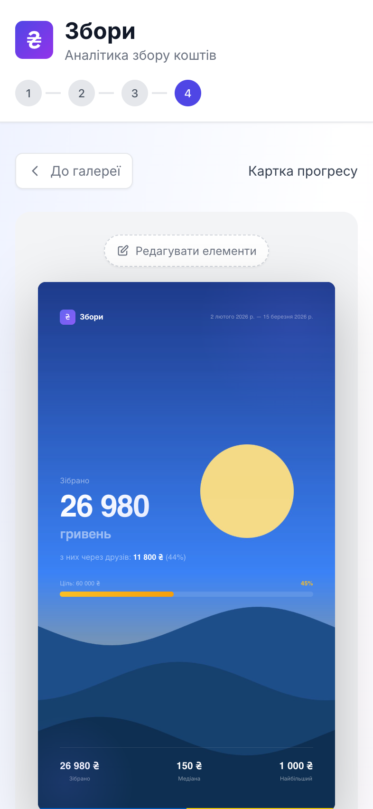
  &nbsp;&nbsp;
  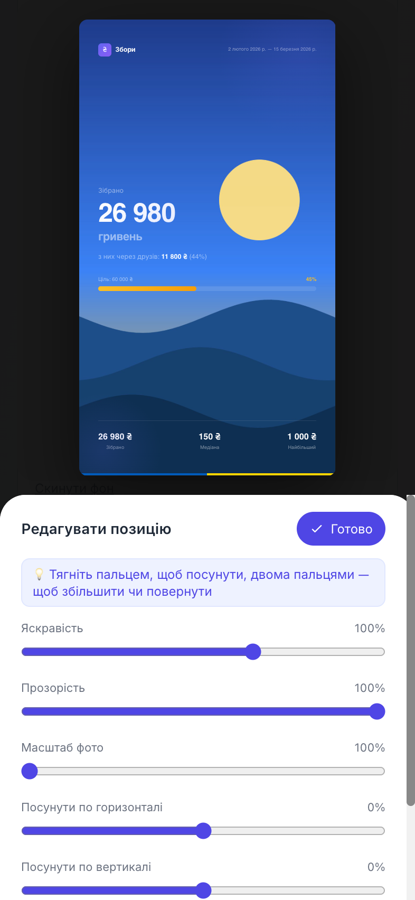
</p>

## Why this exists

Running a fundraiser is two jobs. The first is raising the money; the second is *keeping people engaged* — posting updates, saying thank you, showing how far you've come and what's still missing. Volunteers usually do the second job by hand: copy numbers out of a bank statement, work out percentages, then fight a design tool on a phone at midnight.

Monobank jars give you a CSV statement (or an API) and not much else. Zbory takes that data and does the tedious parts:

- **See what's happening** — totals, pace, best day, who donates repeatedly, when your audience is online, and a forecast of when you'll hit the goal.
- **Know what to post** — it spots share-worthy moments ("100 donations!", "a quarter of the goal", "record day") and links straight to the matching template.
- **Make the graphic in a minute, on a phone** — pick a template, drop in your own photo, remove what you don't need, download a PNG sized for Stories or a post.

It is built for Ukrainian volunteers, mostly working from a phone, so the whole flow is touch-first and the UI is in Ukrainian.

## Screenshots

**Step 1 — your projects, and three ways to start a new one**

| Saved projects | New project | On desktop |
| :---: | :---: | :---: |
| 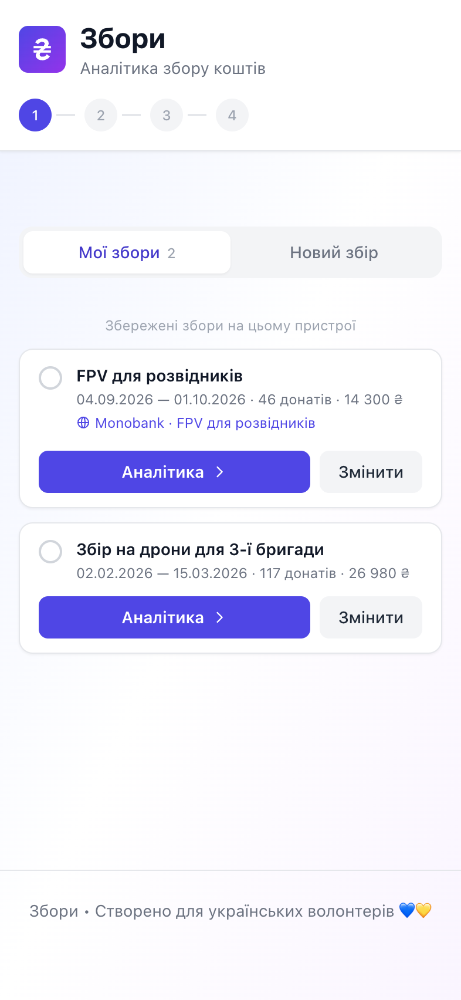 | 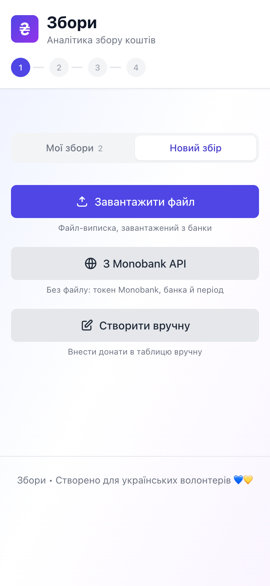 | 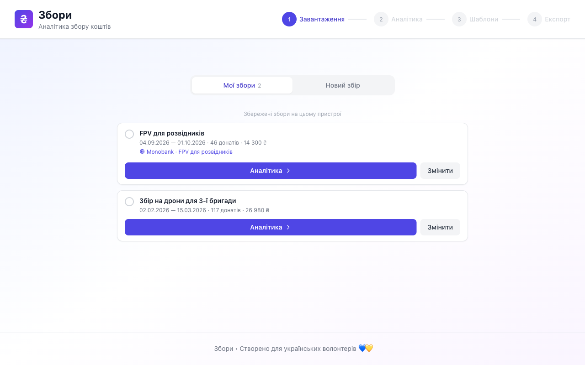 |

**The rest of the flow**

| File preview, goal & friendly jars | Analytics |
| :---: | :---: |
| 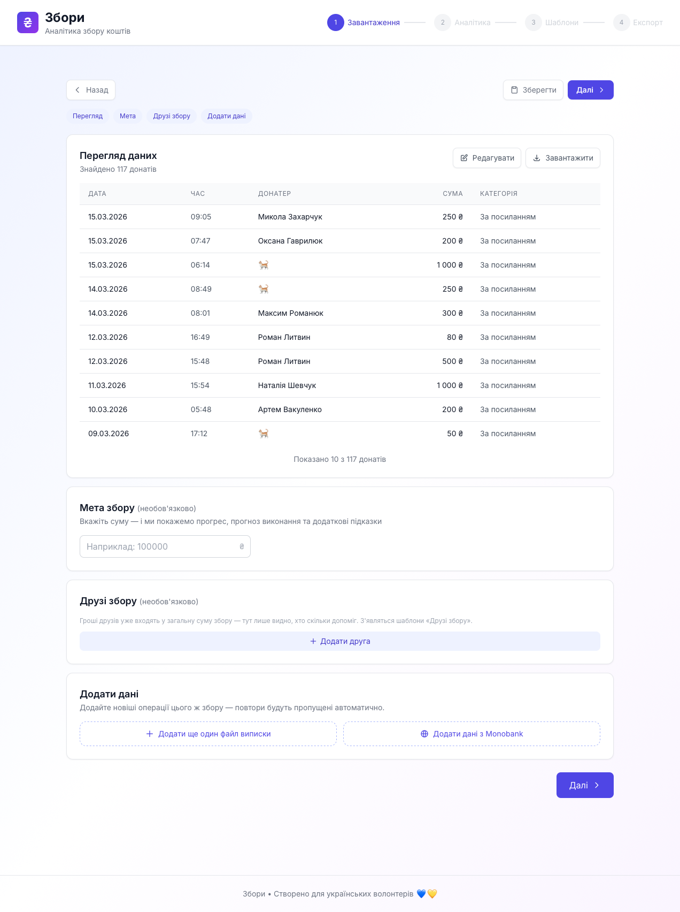 | 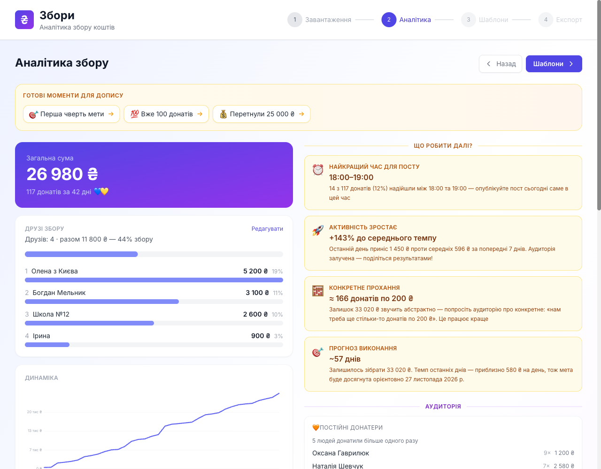 |

| Template gallery |
| :---: |
| 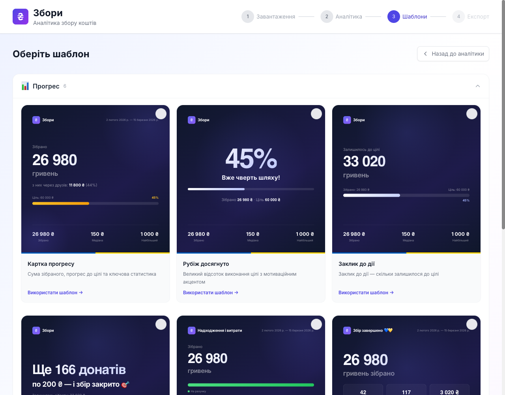 |

Importing from the Monobank API has its own [step-by-step guide](#importing-from-monobank-step-by-step) below.

## Features

### Analytics
- Parses the CSV statement exported from a Monobank jar, **or fetches it straight from the Monobank API**, or lets you type donations in by hand.
- Total raised, donation count, typical (median) vs. average donation, most frequent amount, best day, time-of-day activity, campaign duration.
- Cumulative growth chart and a rolling 30-day chart of donations and withdrawals.
- Repeat donors and most generous donors; anonymous donations are counted but kept out of the lists.
- Goal tracking with a completion forecast, plus actionable suggestions ("best time to post", "ask for a concrete amount").
- **Share-worthy moments** — milestones and records that jump you straight to the right template.
- **Refund detection** — Monobank doesn't list refunds in the statement; the app infers them from balance vs. donations vs. withdrawals.

### Templates & editing
- **19 templates** in five groups: progress, activity, people, friendly jars and reports.
- **Three formats:** 1080×1080 post, 1080×1350 (4:5) post, 1080×1920 Story.
- **Everything is removable** — tap an element in edit mode to hide it; edit any label or text.
- **Your own background** with a full-screen, gesture-isolated editor: drag, pinch-to-zoom, two-finger rotate, brightness and opacity. The page doesn't scroll or move the photo by accident while you edit. Large phone photos are scaled down to 3000 px on upload (about 1:1 at maximum zoom), which keeps exports and saved projects light.
- 8 colour palettes, font scaling, per-card date ranges.
- **Series:** build several cards at once; they share one background and style (a card can detach and keep its own).
- **Themes:** save the current look under a name and switch between looks across fundraisers. Applying a theme copies it, so editing or deleting a theme never changes a card you already made.
- Export a single **PNG**, or the whole series as one **ZIP**. On iOS the file goes through the share sheet ("Save Image").

### Several fundraisers
- **Library** of saved fundraisers kept on your device. Step 1 has two views, *Мої збори* and *Новий збір* (only the latter if nothing is saved). **Аналітика →** on a saved fundraiser goes straight to the analytics with its goal, helpers, background and style intact; **Змінити** opens a small menu to update its data (from Monobank, add a CSV, edit rows, goal and helpers, delete) and lands on the preview with **Зберегти зміни**.
- **Merge** several statement files into one fundraiser (long campaigns come in chunks).
- **Compare fundraisers:** open several at once for a cross-campaign view and report templates ("Звіт за період", comparison chart).

### Monobank API import
Skip the CSV: paste your personal API token and the app pulls a jar's donations directly — jar picker, date range, review table, and later **Оновити з Monobank** to fetch only what's new. The token is never stored. See the [step-by-step guide](#importing-from-monobank-step-by-step).

### Friendly jars (дружні збори)
Monobank lets helpers open their own jars that pay into yours. Those donations are already in your statement, just without saying who brought them. Enter each helper's name and the amount they raised and you get a leaderboard, a "share of the jar" card, a chart on the analytics page, and an optional "of which via friends" line on the progress card. It is **attribution only** — it never changes your totals.

### Everything else
- Installable **PWA**, works offline after the first visit, with an update prompt. The installed app paints the status-bar area in the app's indigo on both iOS and Android.
- **Private by design:** no backend, no accounts, no analytics. Your statement is parsed in the browser and stays there (localStorage for the last session, IndexedDB for saved fundraisers). The only network requests are for the app's own files.
- Self-hosted Inter font (Cyrillic included), so exported PNGs look the same on every device.

## How to use it

1. **Get your data.** Either export the jar's statement as **CSV** in the monobank app (Monobank support can also send a statement file; the app understands both layouts), or use *З Monobank API* with a personal token — no file needed.
2. **Start a project** in *Новий збір*: upload the CSV, [import via the Monobank API](#importing-from-monobank-step-by-step), or choose *Створити вручну*. Check the preview, optionally set a goal and add friendly jars, then continue.
3. **Read the analytics.** Tap a highlighted moment to jump to a matching template, or go on to the gallery.
4. **Pick one or more templates.** Select several to make a series with a shared look.
5. **Edit and export.** Change the format, add your photo (*Фон та стиль → Редагувати позицію*), hide elements, edit text, save a theme, then **Завантажити PNG** (or the ZIP for a series).
6. **Save the fundraiser** from the preview or analytics step if you'll be back — next time pick it in *Мої збори* and tap **Аналітика →** (or **Змінити** to refresh its data first).

## Importing from Monobank (step by step)

No CSV needed: the app can read a jar's donations straight from Monobank with a personal API token. It takes about a minute the first time.

<p align="center">
  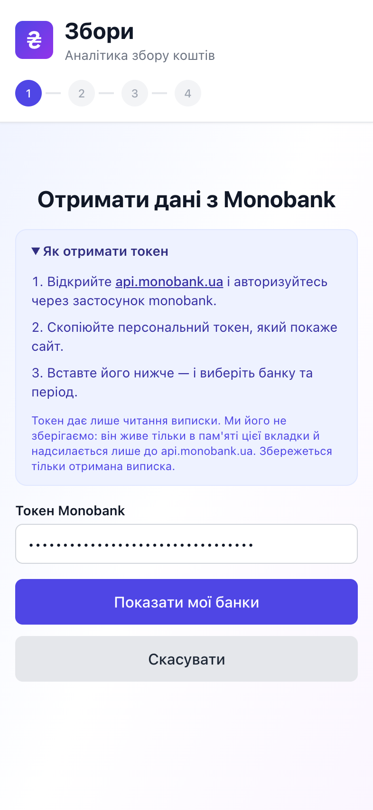
  &nbsp;
  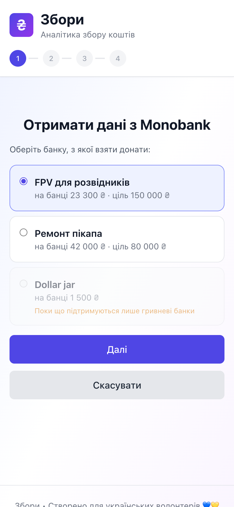
  &nbsp;
  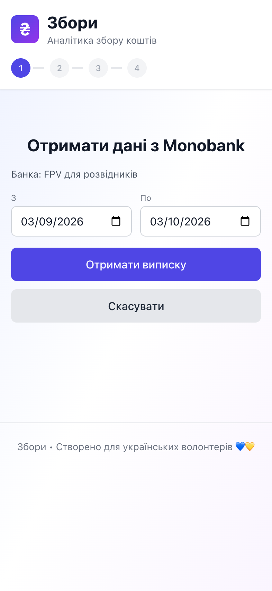
</p>

### 1. Get a token
1. Open **[api.monobank.ua](https://api.monobank.ua/)** and sign in through the monobank app.
2. Copy the personal token the site shows you. (The same instructions are on the import screen.)

### 2. Import
1. On step 1 open **Новий збір → З Monobank API**.
2. Paste the token and tap **Показати мої банки**.
3. Pick the jar. Only **hryvnia** jars can be imported; jars in other currencies are listed but greyed out. The jar's goal is used as the campaign goal.
4. Choose the dates — by default the **last 30 days**. Tap **Отримати виписку**.
5. The donations appear in the same table as manual entry. Fix anything that looks off, then tap **Готово** and carry on as usual (goal, friendly jars, analytics…).
6. **Save** the project. It's named after the jar by default.

### 3. Update it later
Open **Мої збори → Змінити → Оновити з Monobank** on that project (you'll see "Monobank · <jar name>" under its name). Paste a token again, and the app fetches from the day of your newest saved donation and merges the result, skipping anything already there.

<p align="center">
  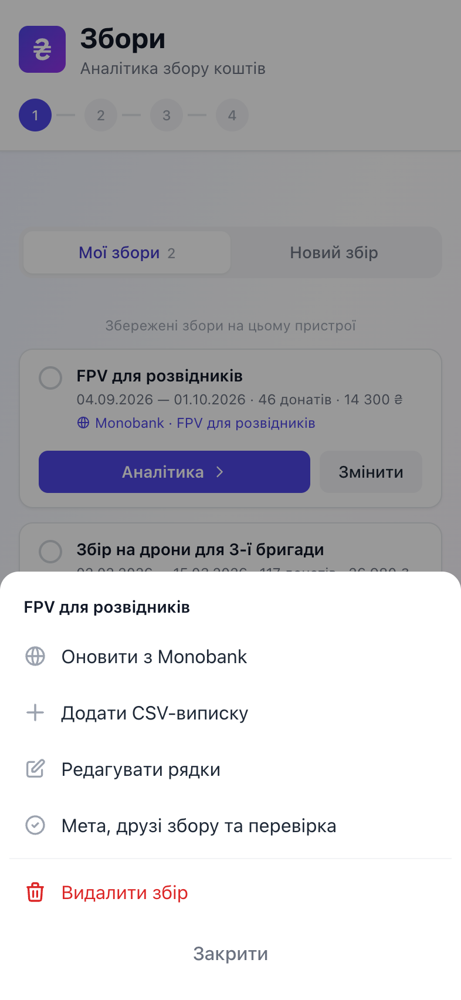
</p>

### Good to know
- **Your token stays on your device.** It lives in memory on that screen only: it is never saved (not in the project, not in the browser's storage), never logged, and is sent only to `api.monobank.ua`. Only the donations it returned, and the jar's id and name, are saved.
- **Times are Kyiv time,** like in monobank's own CSV exports, wherever your device is — so rows fetched from the API line up with a CSV of the same jar, and the date range you pick means Kyiv days.
- **Long periods take a few minutes.** Monobank allows one request per minute per endpoint and 31 days per statement request, so a long range is fetched in parts with a visible countdown, and you can stop at any time. A short range is instant.
- **"Monobank did not accept the token"** — copy it again, completely, with no extra characters.
- **"Monobank asks to wait"** — you hit its rate limit; the app waits a minute and retries by itself.
- **Nothing found for the period** — pick wider dates.
- **Friendly jars.** Donations that came through helpers are included like any other donation, but Monobank doesn't say who brought them, so [helper amounts stay manual](#friendly-jars-дружні-збори).
- No token handy? The CSV export and manual entry work exactly as before.

## Tech stack

| | |
| --- | --- |
| UI | React 18 + TypeScript |
| Build | Vite 6, `vite-plugin-pwa` (Workbox) |
| Styling | Tailwind CSS 3 |
| i18n | i18next / react-i18next (Ukrainian) |
| Charts | Chart.js via react-chartjs-2, plus hand-rolled CSS/SVG charts |
| CSV | PapaParse |
| Image export | `html-to-image` (cards render at native 1080 px and are rasterised offscreen) |
| Monobank | plain `fetch` against the personal API (`src/utils/monobankApi.ts`) — the API answers browser preflights, so no backend or proxy is needed |
| Storage | IndexedDB (fundraisers, themes) behind a small key-value wrapper with in-memory fallback; localStorage for the last session |
| ZIP | a tiny store-only writer (`src/utils/zip.ts`) — PNGs are already compressed, so no dependency |

A few design decisions worth knowing about:

- **Cards are plain React components at 1080 px wide**, scaled down for preview with CSS `zoom` and captured at native size for export — what you see is what you download.
- **Removable elements** are declared per template (`TEMPLATE_REMOVABLE_ELEMENTS`) and marked with `data-element` in the markup, so every template gets edit mode for free.
- **Friendly jars are attribution only.** A helper is `{ name, raised }` and is never added to any total — those donations are already in the main jar's statement.
- **Downloads go through one helper** (`src/utils/download.ts`): the share sheet on iOS, an in-document anchor with a delayed `revokeObjectURL` everywhere else.

### Project layout

```
src/
  pages/            Upload, Insights, Gallery, Export (the four steps)
    ExportPage/       editor: canvas, panels, background gestures, ZIP export
  components/
    templates/        the 19 card templates + shared card shell
    insights/         charts and analytics panels
    upload/           new-project options, preview table, manual entry, Monobank import,
                      saved-project list and its Змінити menu
  context/          app state (reducer) and session wiring
  utils/            parsing, aggregation, insights, storage, export, template config
  i18n/locales/uk/  all UI strings
tests/
  data/             synthetic statements (fake names) used by the tests
  render/           server-render + logic test suites
```

## Development

```bash
npm install
npm run dev          # http://localhost:5173/zbory/
```

| Script | What it does |
| --- | --- |
| `npm run dev` | Vite dev server (the app is served under `/zbory/`) |
| `npm run build` | Type-check, then production build into `dist/` |
| `npm run preview` | Serve the production build locally |
| `npm run lint` | ESLint, zero warnings allowed |
| `npm run test:render` | Run the test suites |

### Tests

`npm run test:render` bundles each `tests/render/*Test.ts(x)` suite with esbuild and runs it in Node. They cover template markup (server-rendered), insight and balance maths, the campaign/theme stores, merging, friendly jars, the Monobank client (windowing, paging, rate limits, mapping — with a faked `fetch` and clock), the edit-mode button layout, and image resizing. Fixtures in `tests/data/` are **synthetic** statements — nothing in the repo is a real donor's data.

To try the app without your own statement, upload `tests/data/Zbir_long.csv`.

### Deployment

Pushes to `main` build and deploy to GitHub Pages via `.github/workflows/deploy.yml`. The app lives under a subpath, so `BASE` in `vite.config.ts` is `/zbory/` and the PWA manifest paths are prefixed with it — keep both in sync if the path changes.

## Roadmap

- **Custom template builder** — compose your own card from the available elements.
- **Friendly-jar attribution from the API** — the personal API exposes nothing about friendly jars (`client-info` lists only your own jars, and statement items don't say which helper a donation came through), so helper amounts stay manual unless Monobank adds it.

## Contributing

Issues and pull requests are welcome. Please run `npm run lint`, `npm run test:render` and `npm run build` before opening a PR.
