# «Збори» — посібник для волонтерів

**Збори** допомагають перетворити виписку з вашої банки monobank на зрозуміле «що в нас відбувається» і на готові картинки для Instagram, Telegram та сторіс. Усе працює у браузері, зручно з телефона.

**Застосунок:** <https://yuliana7.github.io/zbory/>

> 🔒 **Ваші дані нікуди не надсилаються.** Виписка обробляється прямо в браузері й лишається на вашому пристрої. Немає реєстрації та акаунтів. Токен Monobank (якщо ви його вводите) не зберігається взагалі.

> 🧪 **Це бета-версія.** Ми дуже просимо: пробуйте, ламайте й розповідайте, що було незрозуміло. Наприкінці є [список, що саме перевірити](#що-ми-просимо-перевірити-під-час-бета-тесту) і [як надіслати відгук](#як-надіслати-відгук).

> Усі скриншоти в посібнику зроблені на вигаданих тестових даних — імена й суми вигадані.

---

## Зміст

1. [Що потрібно, щоб почати](#1-що-потрібно-щоб-почати)
2. [Крок 1. Додайте дані](#2-крок-1-додайте-дані)
3. [Перевірте дані, задайте мету, додайте друзів](#3-перевірте-дані-задайте-мету-додайте-друзів)
4. [Збережіть збір і повертайтеся до нього](#4-збережіть-збір-і-повертайтеся-до-нього)
5. [Крок 2. Аналітика](#5-крок-2-аналітика)
6. [Крок 3. Оберіть шаблони](#6-крок-3-оберіть-шаблони)
7. [Крок 4. Відредагуйте й завантажте картинку](#7-крок-4-відредагуйте-й-завантажте-картинку)
8. [Дружні банки (друзі збору)](#8-дружні-банки-друзі-збору)
9. [Часті запитання та проблеми](#9-часті-запитання-та-проблеми)
10. [Що ми просимо перевірити під час бета-тесту](#що-ми-просимо-перевірити-під-час-бета-тесту)
11. [Як надіслати відгук](#як-надіслати-відгук)

---

## 1. Що потрібно, щоб почати

- Телефон або комп'ютер із сучасним браузером (Safari, Chrome…).
- Дані вашої банки — одним із трьох способів:
  - **CSV-виписка** з банки monobank;
  - **Monobank API** — персональний токен, без файлу;
  - **вручну** — якщо хочете внести кілька донатів самі.

Застосунок можна **встановити на головний екран** телефона (як звичайну програму), і він працюватиме навіть без інтернету після першого відкриття.

---

## 2. Крок 1. Додайте дані

Відкрийте застосунок. Якщо збережених зборів ще немає, ви одразу побачите три способи почати:

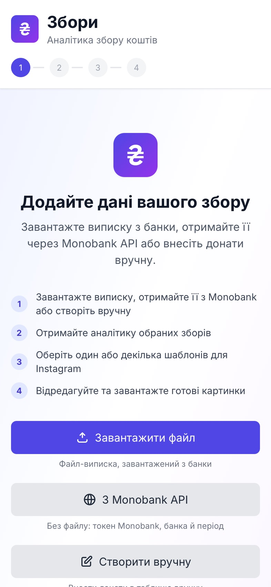

Якщо збори вже є, на першому кроці дві вкладки: **«Мої збори»** і **«Новий збір»**. Новий починається у вкладці «Новий збір».

### Спосіб А. CSV-виписка

1. Отримайте виписку своєї банки у форматі **CSV** (у застосунку monobank; якщо не виходить, виписку можна запросити в підтримці monobank — застосунок розуміє обидва формати).
2. Натисніть **«Завантажити файл»** і виберіть файл.

### Спосіб Б. З Monobank API (без файлу)

Потрібен персональний токен. Отримати його легко — і це займає хвилину:

1. Відкрийте <https://api.monobank.ua/> та увійдіть через застосунок monobank.
2. Скопіюйте персональний токен, який покаже сайт.

Далі в «Збори»: **«Новий збір» → «З Monobank API»**.

  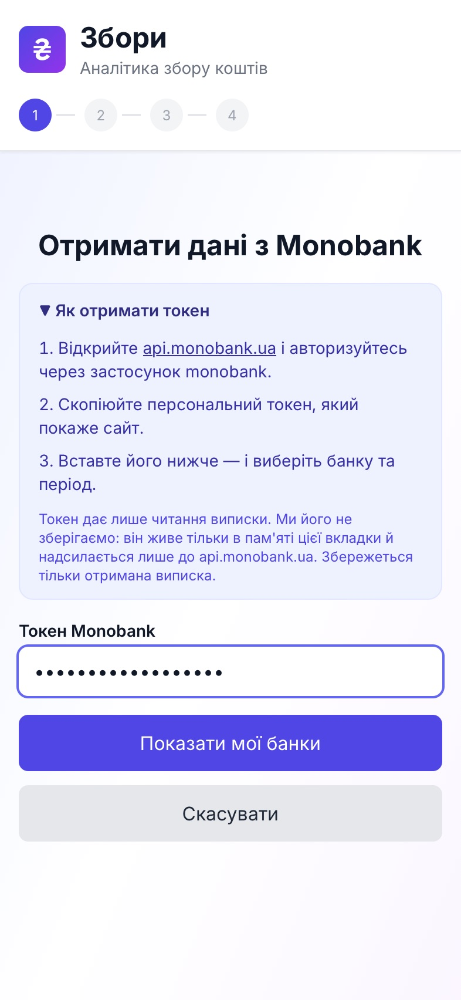
  &nbsp;
  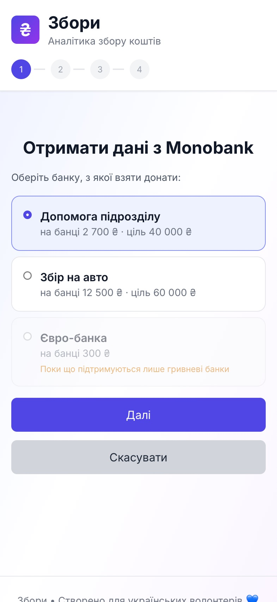
  &nbsp;
  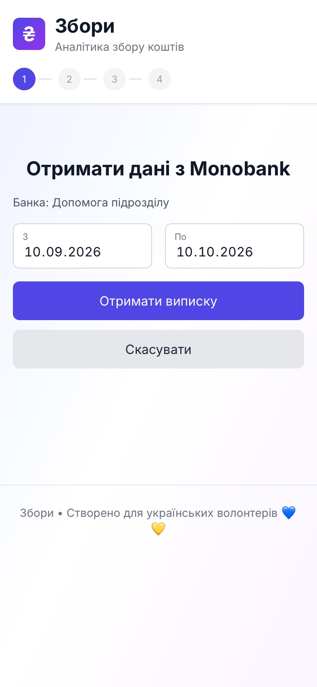

1. Вставте токен і натисніть **«Показати мої банки»**.
2. Оберіть банку. Підходять лише банки в **гривні**; банки в інших валютах видно, але вибрати їх не можна. Мета банки підтягнеться як мета збору.
3. Оберіть дати (за замовчуванням — останні 30 днів) і натисніть **«Отримати виписку»**.
4. Донати з'являться в таблиці — перевірте, за потреби виправте й натисніть **«Готово»**.

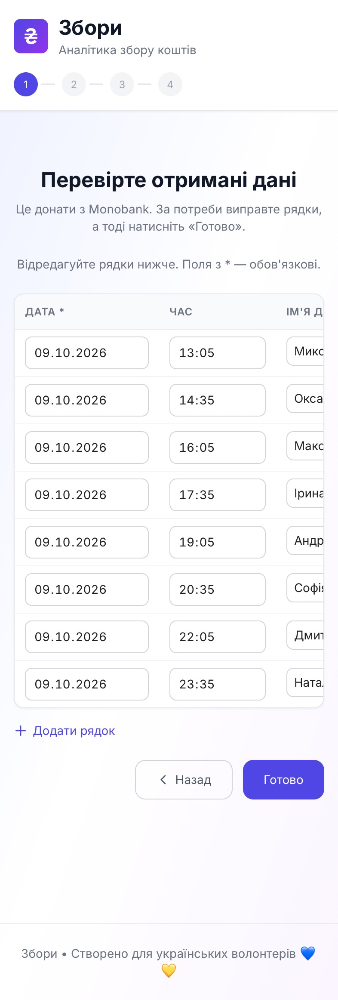

**Варто знати:**

- **Токен нікуди не зберігається.** Він живе лише в пам'яті на цьому екрані й передається тільки до `api.monobank.ua`.
- Monobank дозволяє **один запит на хвилину** і до 31 дня за запит, тому довгий період завантажується частинами, з видимим відліком. Ви можете зупинитися будь-коли.
- «Monobank не прийняв токен» — скопіюйте його ще раз повністю, без зайвих символів.
- «Monobank просить зачекати» — ви натрапили на ліміт запитів. Під час довгого періоду застосунок сам чекає хвилину між запитами; в іншому разі спробуйте ще раз за хвилину.
- «За цей період нічого не знайдено» — оберіть інші дати, ширший період.

### Спосіб В. Вручну

Натисніть **«Створити вручну»** й заповніть таблицю: дата, час, імʼя, сума.

---

## 3. Перевірте дані, задайте мету, додайте друзів

Після завантаження ви потрапите на сторінку перегляду. Вона одна, без поділу на кроки:

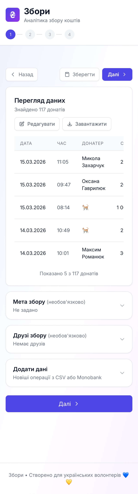

- **Перегляд даних** завжди відкритий: перші 5 рядків і їх кількість. Тут можна **«Редагувати»** рядки або **«Завантажити»** копію у CSV. Якщо якісь рядки не вдалося розпізнати, застосунок попередить перед продовженням.
- **«Мета збору»** (необов'язково) — сума, до якої ви збираєте. Тоді шаблони показують прогрес, а застосунок помічає рубежі («пів мети», «75%»).
- **«Друзі збору»** (необов'язково) — банки ваших помічників. Дивіться [окремий розділ](#8-дружні-банки-друзі-збору).
- **«Додати дані»** — докинути новіші донати з CSV або Monobank, повтори пропускаються автоматично.

Секції згорнуті, але під назвою видно, що в них зараз (наприклад, «Не задано» або «3 друзі»). Торкніться рядка, щоб відкрити.

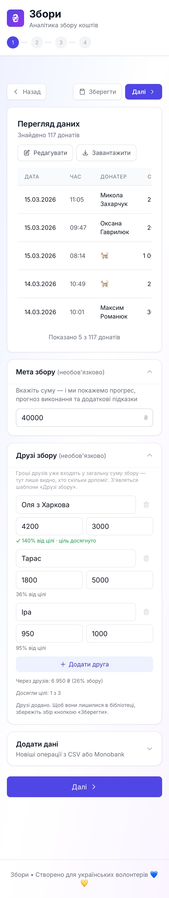

Кнопка **«Далі»** — на аналітику. **«Зберегти»** — залишити збір у вашій бібліотеці. **«Назад»** — повернутися до списку.

---

## 4. Збережіть збір і повертайтеся до нього

Натисніть **«Зберегти»**, дайте збору назву — і він з'явиться у вкладці **«Мої збори»**. Він зберігається **на цьому пристрої**, у браузері.

  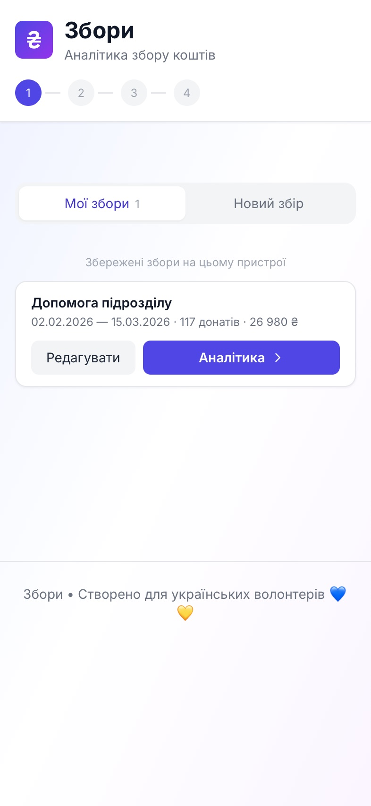
  &nbsp;&nbsp;
  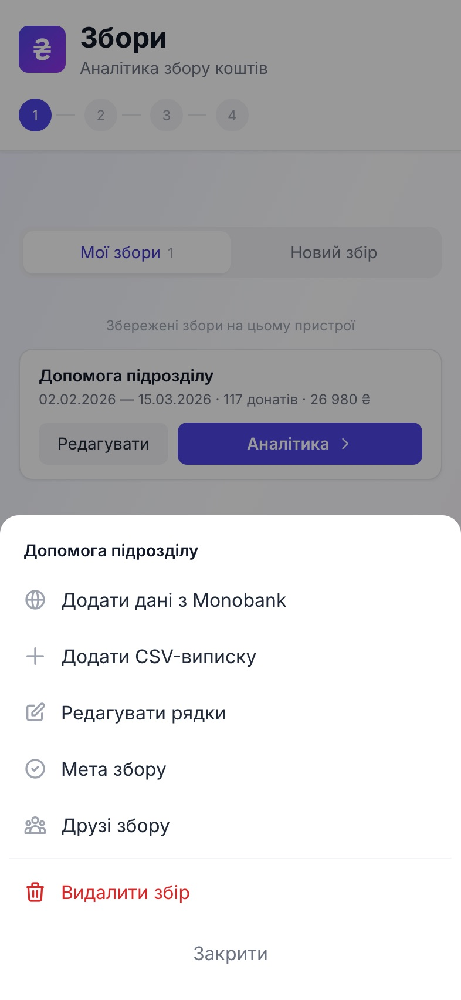

- **«Аналітика →»** — одразу на аналітику, зі збереженою метою, друзями, фоном і стилем.
- **«Редагувати»** відкриває меню, і кожен пункт — це окремий екран саме для цієї дії:
  - **Оновити з Monobank** / **Додати дані з Monobank** — докинути нові донати;
  - **Додати CSV-виписку** — додати ще один файл;
  - **Редагувати рядки** — правити таблицю;
  - **Мета збору** — змінити або прибрати мету;
  - **Друзі збору** — банки помічників;
  - **Видалити збір**.
- Якщо зміни стосуються даних (нові донати, правка рядків), після них ви потрапите на сторінку перегляду — перевірте й натисніть **«Зберегти зміни»**.
- Мета й друзі зберігаються одразу, як тільки ви натиснете «Зберегти».

> ⚠️ Збори лежать у браузері цього пристрою. Якщо очистити дані сайту або зайти з іншого пристрою, їх там не буде. Тому, щоб мати копію, скористайтеся **«Завантажити»** (CSV) на сторінці перегляду.

**Кілька зборів разом.** У «Моїх зборах» можна позначити кілька зборів і натиснути **«Аналізувати разом (N)»** — тоді з'являться порівняння між зборами та звіти за період.

---

## 5. Крок 2. Аналітика

  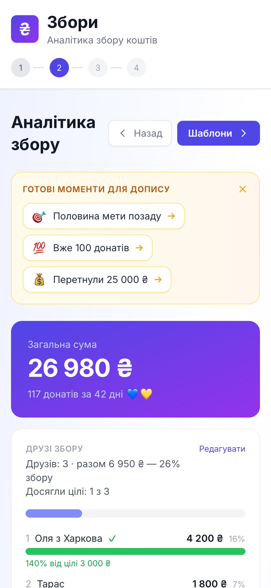
  &nbsp;
  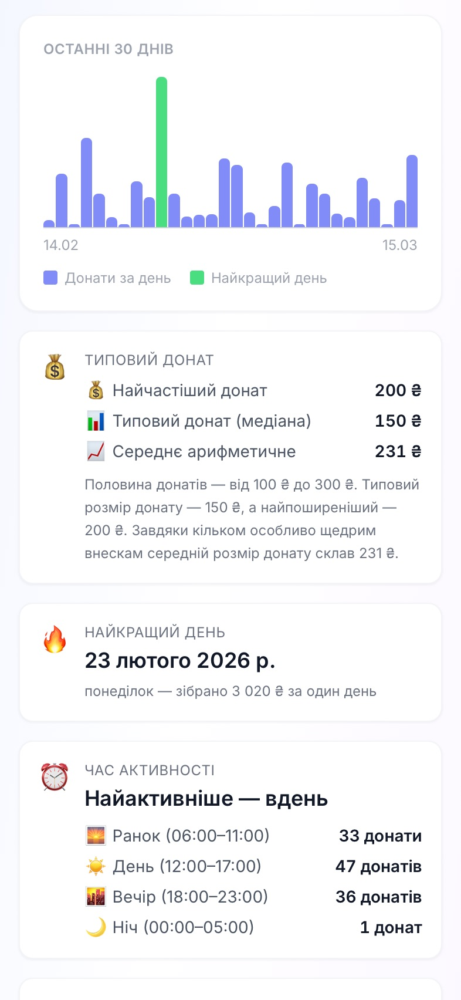
  &nbsp;
  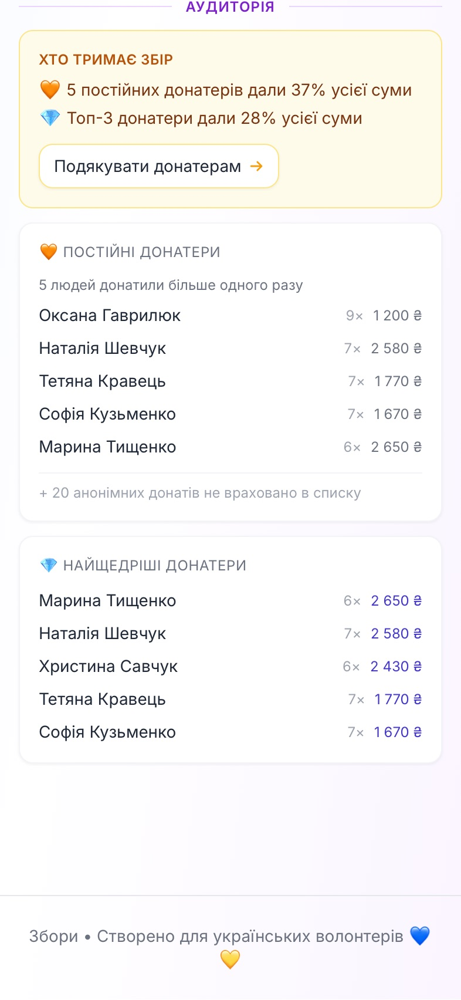

Що ви побачите:

- **«Готові моменти для допису»** — рубежі, які варто відсвяткувати: «Вже 100 донатів», «Половина мети позаду», «Рекордний день». Торкніться моменту — і ви потрапите на підходящий шаблон. Блок можна закрити хрестиком; доки ви працюєте з цим збором, він не повернеться.
- **Загальна сума**, кількість донатів і тривалість (скільки днів ішов збір; один день — це 1 день).
- **Друзі збору** — прогрес кожної банки до її мети (див. [розділ 8](#8-дружні-банки-друзі-збору)).
- **Графіки:** зростання суми та донати за день (до 30 останніх днів; якщо збір молодший, показано лише його дні). Блок «На рахунку» зʼявляється тільки коли були зняття коштів або повернення.
- **Картки-підказки:** типовий донат, найкращий день, час активності.
- **«Аудиторія»:** хто тримає збір — скільки відсотків суми дали постійні донатори й топ-3, кнопка **«Подякувати донатерам»** веде до шаблону подяки; також найпопулярніші емоджі та списки постійних і найщедріших. Анонімні донати враховані в сумі, але не потрапляють до списків.

Далі — кнопка **«Шаблони»**.

---

## 6. Крок 3. Оберіть шаблони

  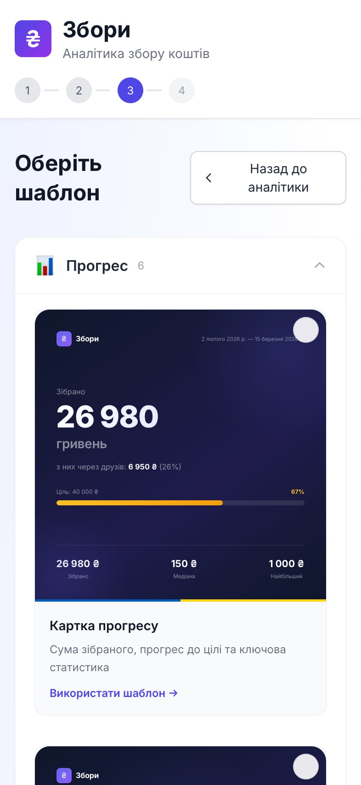
  &nbsp;&nbsp;
  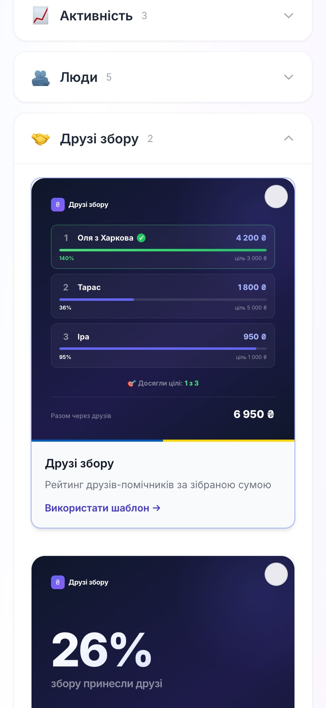

Шаблони розкладені за групами: **Прогрес**, **Активність**, **Люди**, **Друзі збору** та звіти. Усього 19 шаблонів.

- Торкніться картки, щоб відкрити її в редакторі.
- Можна відкрити **кілька шаблонів** і зробити **серію**: усі картки матимуть спільний фон і стиль.

---

## 7. Крок 4. Відредагуйте й завантажте картинку

  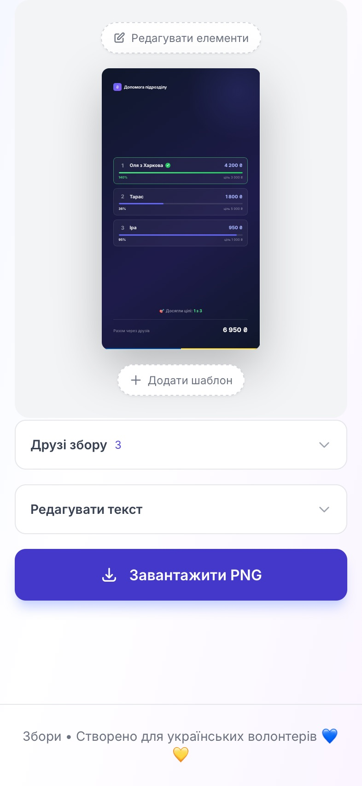
  &nbsp;&nbsp;
  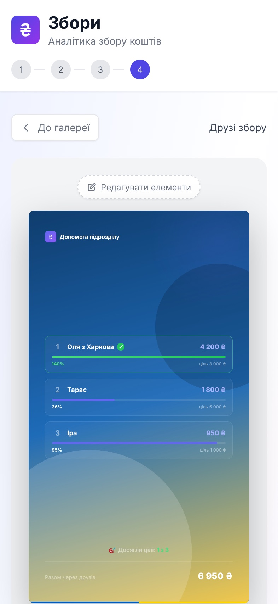

Редактор показує картку у зменшеному вигляді, а в результаті ви отримаєте файл **1080 пікселів** завширшки.

### Основне

- **Формат:** пост 1:1, пост 4:5 або сторіс 9:16.
- **«Редагувати елементи»** — натискайте на частини картки, щоб прибрати те, чого не треба.
- **«Редагувати текст»** — змініть підписи й заголовки.
- **Розмір тексту** — повзунок.
- Якщо серія з кількох карток, у блоці **«Свій стиль для цієї картки»** можна відв'язати поточну картку від спільного стилю.
- **«Додати шаблон»** — додати ще одну картку до серії.
- **Діапазон дат** (для шаблонів, де він підходить) — показати лише частину збору.

### Власний фон

  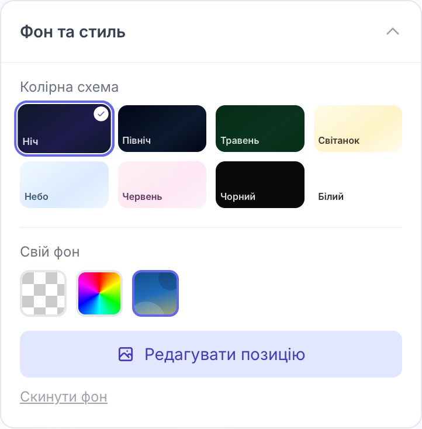
  &nbsp;&nbsp;
  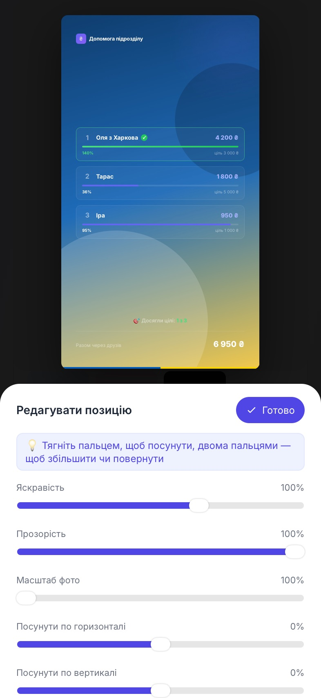

1. Відкрийте **«Фон та стиль»**, оберіть кольорову палітру або **«Свій фон»**: прозорий, колір чи **фото**.
2. Для фото натисніть **«Редагувати позицію»**: відкриється повноекранний редактор. **Одним пальцем** перетягуйте фото, **двома** — збільшуйте й повертайте. Нижче — яскравість, прозорість, масштаб і зсув. Сторінка при цьому не гортається, фото не зсувається випадково.
3. Натисніть **«Готово»**.

> Великі фото з телефона автоматично зменшуються до 3000 пікселів, цього достатньо для чіткої картинки.

### Теми

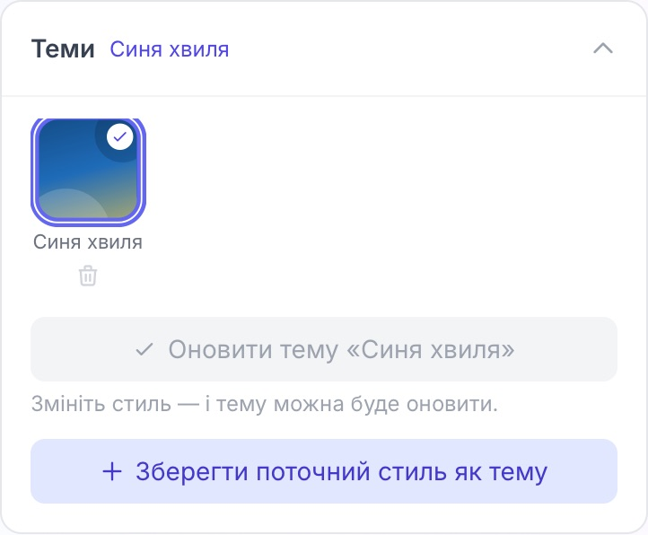

Знайшли вдалий вигляд? Збережіть його як **тему**: **«Теми» → «Зберегти поточний стиль як тему»**. Потім її можна застосувати до будь-якого збору. Тема — це копія: якщо ви потім зміните чи видалите тему, картки, де вона вже застосована, не зміняться. Якщо ви трохи підправили стиль, натисніть **«Оновити тему»**, щоб записати зміни в неї.

### Завантаження

- **«Завантажити PNG»** — одна картка.
- **«Завантажити всі · ZIP»** — вся серія одним архівом.
- На **iPhone** файл відкриється в меню «Поділитися»: оберіть **«Зберегти зображення»**.

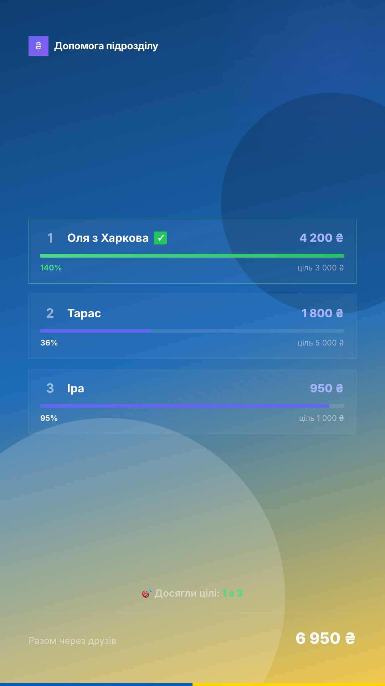

---

## 8. Дружні банки (друзі збору)

У monobank помічники можуть відкривати **власні банки**, що наповнюють вашу. Ці гроші **вже входять** у вашу виписку, але без підпису, хто саме їх приніс. Тут ви вказуєте, хто скільки зібрав, — і отримуєте рейтинг, графік і картки.

> 💡 Це лише **підпис «хто допоміг»**: суми друзів **ніколи не додаються** до загальної суми й не змінюють її. Monobank не надає цих даних, тому суми вводяться вручну.

### Як додати

На сторінці перегляду (або **«Редагувати» → «Друзі збору»**, або в редакторі картки) відкрийте **«Друзі збору»**:

1. **«Додати друга»**.
2. Вкажіть **ім'я або назву**, **«Зібрано, ₴»** і, за бажання, **«Ціль, ₴»**.
3. Натисніть **«Зберегти друзів»** — інакше зміни не потраплять на картки. Поки ви не зберегли, внизу висвітиться жовте нагадування.

Правила:

- **Імена мають бути різними** (великі й малі літери та зайві пробіли не враховуються). Якщо імена збігаються, поля підсвітяться червоним, і зберегти не вийде.
- Якщо піти зі сторінки з незбереженими змінами, застосунок запитає: **зберегти і продовжити**, **не зберігати** чи **лишитися**.
- Якщо збір уже збережено, друзі записуються у бібліотеку одразу. Якщо ні — вони зберігаються лише на цей сеанс, поки ви не натиснете **«Зберегти»** на самому зборі.

### Ціль друга

Якщо в друга є ціль, його смужка показує **власний прогрес** («зібрано / ціль»), а не порівняння з найбільшим. Можна перевиконати: смужка заповнюється повністю, пишеться справжній відсоток (наприклад, **140%**), а біля імені з'являється зелена **галочка ✓**. Якщо цілі немає ні в кого, смужки порівнюють друзів між собою.

### На картці

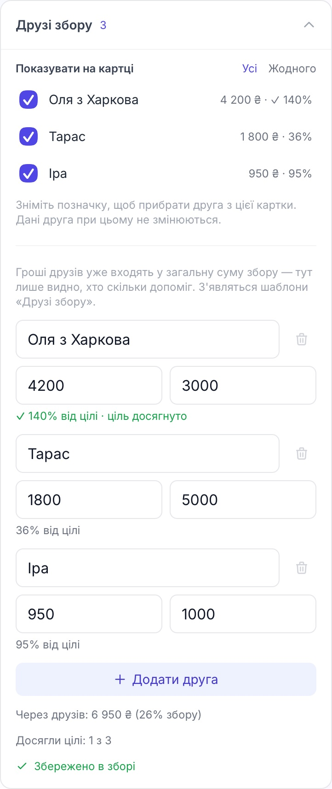

У шаблонах групи «Друзі збору» є таблиця лідерів і картка «Внесок друзів». У редакторі таблиці лідерів є список **«Показувати на картці»**: ставте й знімайте позначки, щоб обрати, хто потрапить на картку (**«Усі»** / **«Жодного»**). Дані друзів при цьому не змінюються. Сума внизу картки й рядок «Досягли цілі: 2 з 3» рахуються лише по тих, кого ви показали.

---

## 9. Часті запитання та проблеми

**Чи безпечно вводити токен Monobank?**
Токен дає лише читання виписки. Застосунок не зберігає його ніде — ні в проєкті, ні в браузері — і надсилає тільки на `api.monobank.ua`. Нікому не пересилайте свій токен і не публікуйте його в скриншотах.

**Чому збір «Мої збори» зник?**
Збори зберігаються в браузері. Їх не буде після очищення даних сайту, в іншому браузері або на іншому пристрої. Робіть копію через **«Завантажити»** (CSV) на сторінці перегляду.

**Час донатів інший, ніж у виписці.**
Застосунок показує час за **вашим годинником**, а файли CSV від Monobank завжди містять київський час. Якщо ви не в Києві, години можуть відрізнятися на різницю поясів — суми й дати від цього не змінюються.

**Донати задвоїлись після додавання даних.**
Такого не повинно бути: рядки, які вже є, розпізнаються й пропускаються. Якщо це сталося, напишіть нам (див. [відгук](#як-надіслати-відгук)) і прикладіть рядки, де помітили повтор, без імен донорів.

**На iPhone картка не завантажується.**
Файл має відкритися в меню «Поділитися» — обирайте «Зберегти зображення». Якщо не вийшло, повідомте нас, вказавши модель телефона й версію iOS.

**Фото на картці виглядає обрізаним.**
Відкрийте **«Фон та стиль» → «Редагувати позицію»** та підберіть масштаб і положення.

**Чому шаблон «Друзі збору» порожній?**
Спочатку додайте друзів і натисніть **«Зберегти друзів»** (див. [розділ 8](#8-дружні-банки-друзі-збору)).

**Чи можна автоматично отримати суми друзів із monobank?**
Поки ні: Monobank не віддає ці дані у своєму офіційному API, тож їх вводять вручну.

---

## Що ми просимо перевірити під час бета-тесту

Не обов'язково все одразу — оберіть те, що вам ближче. Вкажіть у відгуку, **на якому пристрої й у якому браузері** ви пробували.

1. **Новий збір з CSV:** завантажили файл → перевірили перегляд → дійшли до аналітики. Усе зрозуміло?
2. **Monobank API:** отримали токен, обрали банку, отримали виписку. Що було незрозуміло в підказках?
3. **Збереження:** зберегли збір, закрили вкладку, відкрили знову. Чи на місці дані, мета й друзі?
4. **«Редагувати»:** оновлення з Monobank, додавання CSV, зміна мети й друзів. Чи завжди зрозуміло, де ви опинилися і як повернутись?
5. **Друзі збору:** додали кількох друзів із цілями й без, перевиконали ціль, спробували однакові імена, пішли зі сторінки без збереження.
6. **Шаблони:** зробили картку зі своїм фото, серію з кількох карток, тему. Чи можна було легко знайти, що змінити?
7. **Завантаження:** PNG і ZIP — чи збереглося на вашому телефоні, чи виглядає як у редакторі?
8. **Загалом:** де ви застрягли? Що виглядало дивно? Чого вам не вистачило?

---

## Як надіслати відгук

Найкраще — завести запис на GitHub: <https://github.com/Yuliana7/zbory/issues> (кнопка **New issue**). Якщо там не зручно, надішліть відгук тому, хто запросив вас до тесту.

Що вказати:

- **Що ви робили** (кроки).
- **Що очікували** і **що вийшло**.
- **Скриншот** (за можливості; **без реальних імен донорів і без токена**).
- **Пристрій і браузер**, наприклад «iPhone 13, Safari».

Дякуємо, що допомагаєте зробити «Збори» кращими. 💙💛
